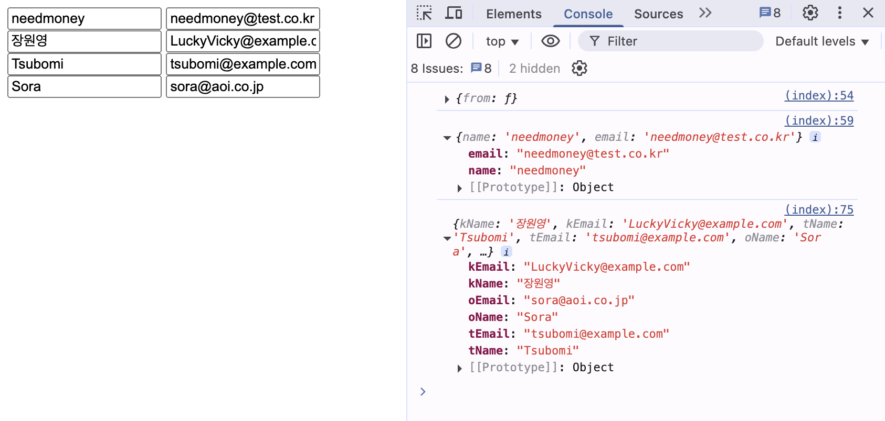

# DOMRMjs

**DOMRM**은 DOM을 *RM*해드립니다.  
"Remove"가 아닙니다.  
**RM = Rapid Mapping**  
병맛 DOM 구조도 데이터로 후딱 뽑아드립니다.

> jQuery 기반, 빠르고 직관적인 DOM 추출 유틸  
> 값 뽑고, 속성 뽑고, `build()` 하면 끝!   

---

## 설치

`<script>`로 쓰고 싶다면:

```html
<script src="https://unpkg.com/domrmjs/dist/domrm.umd.js"></script>
```

> 글로벌 변수 `DOMRM`으로 접근 가능.

또는 Node Module로 쓰고 싶다면?

```bash
npm install domrm
```

> 얘는 테스트 해 볼게요... 아직 안 해 봄^^.

---

## 예시(Node)

```html
<form id="loginForm">
  <input name="username" value="neo" />
  <input name="password" value="matrix" />
</form>
```

```ts
import { DOMRM } from 'domrmjs'

const data = DOMRM
  .from($('#loginForm'))
  .find('[name="username"]').valAs('id')
  .find('[name="password"]').valAs('pw')
  .build()

console.log(data) // { id: 'neo', pw: 'matrix' }
```

## 예시(CDN)

**jQuery를 먼저 로드**하세요.

```html
<!DOCTYPE html>
<html lang="en">
<head>
    <meta charset="UTF-8">
    <title>DOMRM</title>
    <!-- JQuery를 먼저 로드 -->
    <script src="https://code.jquery.com/jquery-3.7.1.slim.js" integrity="sha256-UgvvN8vBkgO0luPSUl2s8TIlOSYRoGFAX4jlCIm9Adc=" crossorigin="anonymous"></script>
    <script src="dist/domrm.umd.js"></script>
</head>
<body>
    <div id="app">
        <div id="container">
            <input id="name" value="needmoney">
            <input id="email" value="needmoney@test.co.kr">
        </div>
    </div>
    <div id="universe">
        <section class="planet" id="earth">
            <div class="continent">
                <div class="country">
                    <div class="korea">
                        <div class="city">
                            <div class="person">
                                <input class="name" value="장원영">
                                <input class="email" value="LuckyVicky@example.com">
                            </div>
                        </div>
                    </div>
                    <div class="japan">
                        <div class="city">
                            <div class="tokyo">
                                <div class="person">
                                    <input class="name" value="Tsubomi">
                                    <input class="email" value="tsubomi@example.com">
                                </div>
                            </div>
                            <div class="osaka">
                                <div class="person">
                                    <input class="name" value="Sora">
                                    <input class="email" value="sora@aoi.co.jp">
                                </div>
                            </div>
                        </div>
                    </div>
                </div>
            </div>
        </section>
    </div>


    <script type="text/javascript">
        document.addEventListener('DOMContentLoaded', () => {
            console.info(DOMRM)
            let data = DOMRM.from($('#container'))
                    .find('#name').valAs('name')
                    .find('#email').valAs('email')
                    .build()
            console.info(data)

            data = DOMRM.from($('.korea'))
                    .descend('.person')
                    .find('.name').valAs('kName')
                    .find('.email').valAs('kEmail')
                    .ascend('.country')
                    .descend('.japan')
                    .descend('.tokyo')
                    .find('.name').valAs('tName')
                    .find('.email').valAs('tEmail')
                    .ascend('.country')
                    .descend('.osaka')
                    .find('.name').valAs('oName')
                    .find('.email').valAs('oEmail')
                    .build()
            console.info(data)
        })
    </script>
</body>
</html>
```



## 문법

```ts
DOMRM.from(element: HTMLElement | JQuery): DOMRMBuilder
```

### 체이닝 메서드

| 메서드 | 설명 |
|:-----|-----|
| from(element) |	지정한 루트 요소로부터 DOMRM 체이닝을 시작 |
| find(selector) |	현재 루트 요소 내부에서 요소를 찾아 $element로 설정 |
| closest(selector) |	현재 루트 요소에서 가장 가까운 조상 요소를 찾아 $element로 설정 |
| descend(selector) |	루트 요소를 지정한 하위 요소로 이동하고 해당 요소를 $element로 설정 |
| ascend(selector) |	루트 요소를 지정한 상위 요소로 이동하고 해당 요소를 $element로 설정 |
| valAs(key) |	$element.val() 값을 문자열로 추출하여 key에 저장 |
| valAsNum(key) |	$element.val() 값을 숫자로 변환하여 key에 저장 |
| textAs(key) |	$element.text() 값을 추출하여 key에 저장 |
| attrAs(attrName) |	$element.attr(attrName) 값을 추출하여 key에 저장 |
| custom(key, fn) |	$element을 인자로 전달해 fn의 실행 결과를 key에 저장 |
| build() |	체이닝 도중 저장한 모든 값을 포함한 객체를 반환 |

---

## 커스텀 추출 예제

```ts
const data = DOMRM
  .from($('#price'))
  .custom('length', ($el) => {
    const val = $el.val()
    if (typeof val === 'string') {
      return val.length
    } else {
      throw new Error('Expected string')
    }
  })
  .build()

console.log(data) // { length: 5 }
```

---

## 철학

- jQuery 시대 유산들과 공존하며 살아가기
- 테스트는 있지만 타입 안정성은 적당히 타협
- DOM은 어차피 망가질 것이므로 유연하게 대응

---

## 테스트

```bash
npm test
```

---

## IE 지원?

> 웃으면 복이 와요.  
> 그래서 지원합니다. 안 할 수도 있어요. 해 보셈.

---

## 기여

Pull Request, 병맛 제안, 이슈 제보 환영합니다.  
단, 철학에 어긋나는 **과도한 진지함**은 삼가주세요.

---

## 라이선스

MIT  
*Do whatever you want. Just don’t blame me.*
